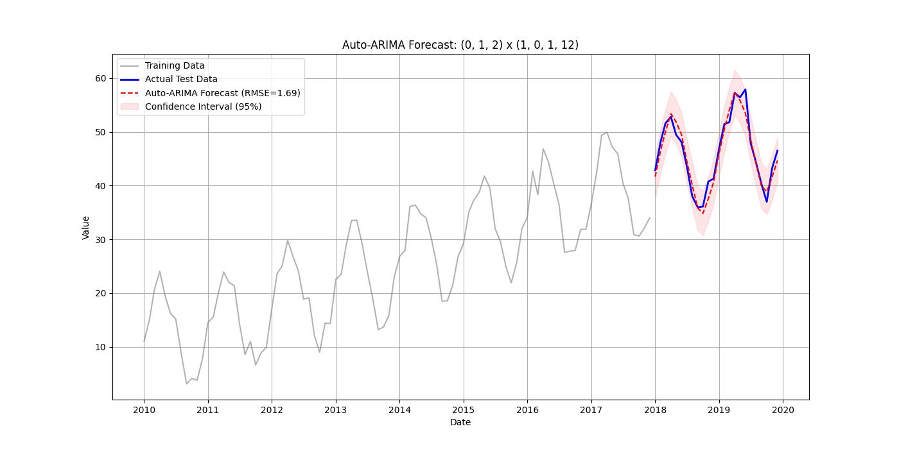

# Auto-ARIMA Forecasting Example

This project serves as a comprehensive practical example of time series forecasting using the `pmdarima` library in Python. It specifically leverages the powerful Auto-ARIMA functionality to automatically identify optimal model parameters (p, d, q) validation metrics. By generating a synthetic dataset characterized by a distinct linear trend and robust yearly seasonality, the application demonstrates the complete end-to-end workflow: from data generation and visualization to automated model selection, statistical stationarity testing, and generating future predictions with confidence intervals. This codebase is designed to provide a clear, reusable template for applying advanced ARIMA modeling techniques to real-world predictive analysis scenarios.

## Features

- **Synthetic Data Generation**: Creates realistic time series data with trend, seasonality, and noise.
- **Auto-ARIMA**: Uses `pmdarima` to automatically find the best ARIMA model.
- **Visualization**: Generates and saves plots comparing actual data vs. forecasts.
- **Evaluation**: Calculates RMSE to measure model performance.

## Output

The script saves a high-quality visualization of the forecast to `arima_forecast.png`, showing the training data, actual test data, forecast line, and confidence intervals.



## Installation

1.  **Clone the repository:**
    ```bash
    git clone <repository_url>
    cd arima_example
    ```

2.  **Create and activate a virtual environment:**
    ```bash
    python3 -m venv .venv
    source .venv/bin/activate
    ```

3.  **Install dependencies:**
    ```bash
    pip install -r requirements.txt
    ```

## Usage

Run the main script to generate the synthetic data, train the model, and save the forecast plot:

```bash
python pdarima_ex.py
```


